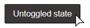

**JSFiddle URL: https://jsfiddle.net/gh/get/library/pure/stamminator/jsfiddle-demos/tree/master/pleasant-toggle-button**

Demo of a two-state toggle button with several notable features:

1. The width of the button stays the same even as it switches between two toggle states with different length text. The button's width is derived from the natural content width of whichever of the two toggle states' labels is wider. No hard-coded widths or JS width calculation, just a bit of flexbox magic. 

    

2. The two states can be specified either with HTML elements or CSS variables:
    - **HTML** - The button should use the `btn-toggle` class and contain two elements, where the first element is the "default" state and the second element is the "toggled" state.
        ```html
        <button type="button" class="btn btn-toggle" onclick="this.classList.toggle('toggled')">
            <span>Default state</span>
            <span>Toggled state</span>
        </button>
        ```
    - **CSS** - Alternatively, your button can use the `btn-toggle-css` class and specify the two states' labels with the `--default-text` and `--toggled-text` CSS variables. Specify default values in your stylesheet and override on the element itself as needed.
        ```html
        <button type="button" class="btn btn-toggle-css" onclick="this.classList.toggle('toggled')"
            style="--default-text: 'Overridden default state'; --toggled-text: 'Overridden toggled state'">
        </button>
        ```
3. To improve accessibility by specifying which label to use via ARIA attributes, use the included `toggleButton` JavaScript function to handle click events.
    ```html
    <button type="button" class="btn btn-toggle" onclick="toggleButton(this)">
        <span>Accessible label (default)</span>
        <span>Accessible label (toggled)</span>
    </button>
    ```
    To make sure the `aria-hidden` attributes are set correctly on load without having to wait for a click event to set them, either write them in the markup or set the toggled state to false (default) on load.
    ```js
    addEventListener("DOMContentLoaded", () => {
        toggleButton(document.querySelectorAll(".someSelector"), () => false);
    });
    ```

4. To keep the button's toggle state in sync with some external state (such as changing from "select all" to "unselect all" only when a set of checkbox inputs are all checked) and enforce that state on page load, see the `advancedToggleButton` example in the source code.

Included styles work fine alone, but also play nice with Bootstrap's `btn` styling and naming convention.